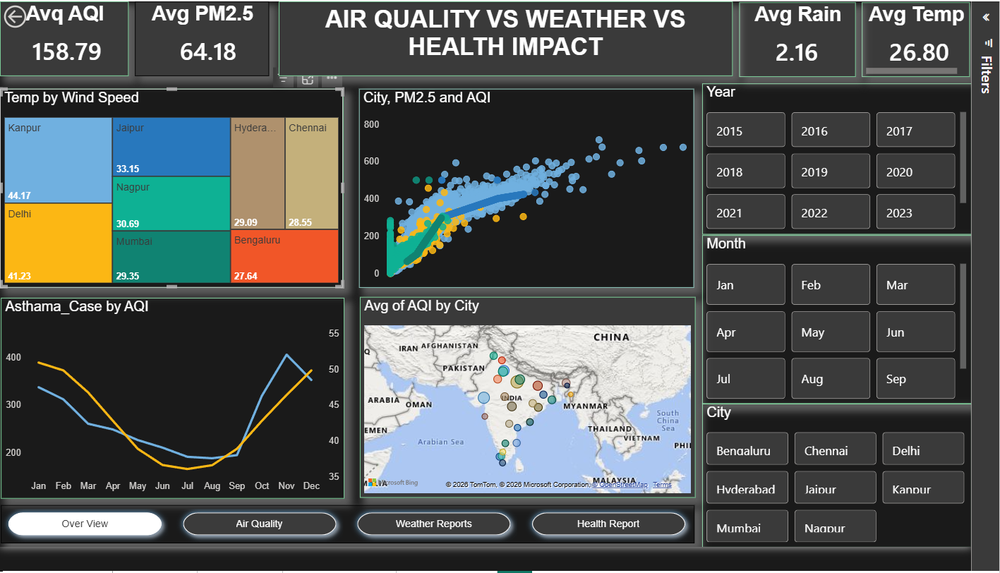
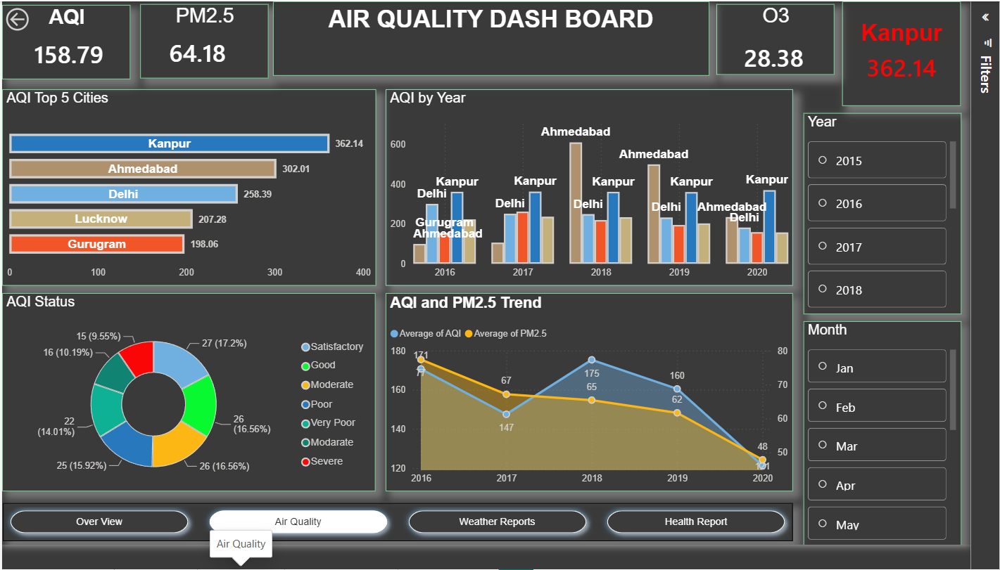
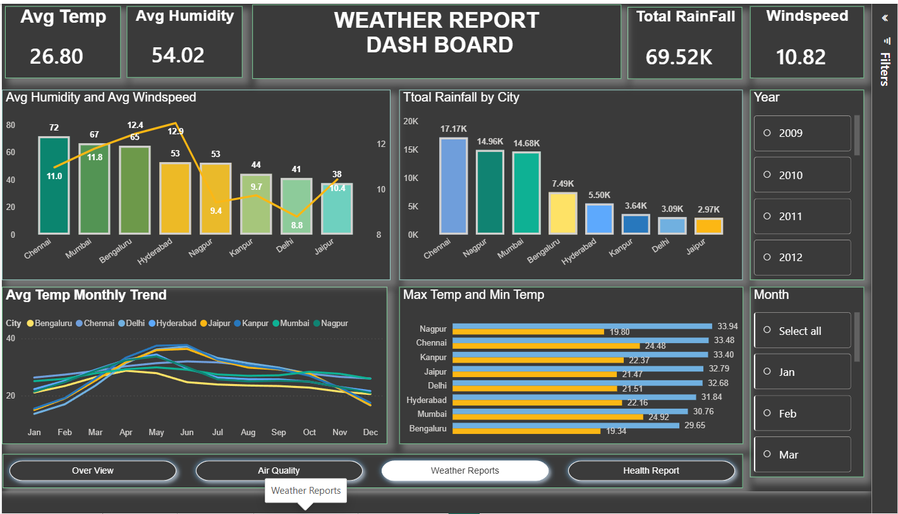
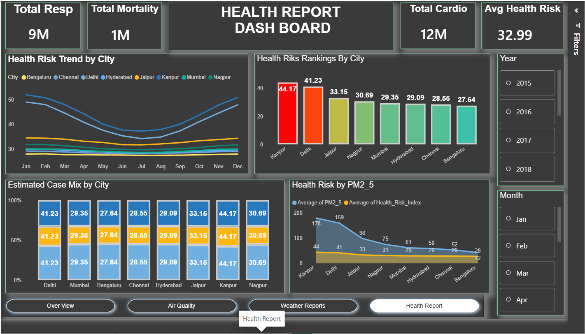

# Air Quality, Weather & Public Health Impact — India (2009–2024)

End-to-end data analytics project: raw CSV data → MySQL → Python (EDA) → Power BI dashboard, exploring how air pollution relates to weather and public health outcomes across Indian cities.

📄 **[Read the full case study (PDF)](docs/Case_Study.pdf)**

---

## Project Overview

Three independent datasets — daily weather readings, daily air quality readings, and modeled public-health impact estimates — are combined to answer:

1. Which Indian cities have the worst air quality?
2. Does higher pollution measurably line up with respiratory/cardiovascular case estimates?
3. Does rainfall show any relationship with pollution levels?

## Key Findings

- AQI and modeled Health Risk Index are strongly correlated (**r = 0.82**) across cities
- PM2.5 is also strongly correlated with Health Risk Index (**r = 0.79**)
- **Kanpur** and **Delhi** are the most polluted cities in the common-city sample — average AQI ~3x higher than Mumbai
- Rainfall shows a weak negative correlation with AQI (**r = -0.13**), consistent with rain clearing particulate matter
- See the [case study](docs/Case_Study.pdf) for full limitations and honest caveats on the health-data correlations

## Tech Stack

| Layer | Tools |
|---|---|
| Data Engineering | MySQL — bulk load (`LOAD DATA INFILE`), NULL handling, multi-table JOINs, VIEWs, window functions |
| Exploratory Analysis | Python — Pandas, Seaborn, Matplotlib |
| Dashboard | Power BI — star-schema model, DAX measures, 4-page interactive report |

## Repository Structure

```
├── sql/
│   └── SQL_for_Main_project.sql       # Table creation, data load, joins, views, analysis queries
├── notebook/
│   └── Main_Project.ipynb              # Data cleaning, merging, EDA, correlation analysis
├── dashboard/
│   └── Main_Project.pbix               # 4-page interactive Power BI report
├── data/
│   ├── Air_Quality_updated.csv
│   ├── Weather_Report_updated.csv
│   └── Health_Report.csv
├── docs/
│   └── Case_Study.pdf                  # Full write-up: methodology, findings, limitations
├── images/
│   ├── overview.png
│   ├── air_quality.png
│   ├── weather.png
│   └── health.png
└── README.md
```

## Data Sources

| Dataset | Rows | Coverage |
|---|---|---|
| Air Quality | 33,549 | 26 cities, Jan 2015 – Jul 2020 |
| Weather | 32,144 | 8 cities, 2009–2020 |
| Health Impact | 29,224 | 8 cities, 2015–2024 (modeled estimates, not hospital records) |

## Dashboard Preview

**Over View** — cross-dataset KPIs, city/year/month slicers, treemap, scatter, map


**Air Quality** — city ranking, AQI trend by year, AQI category breakdown


**Weather Reports** — temperature trend, rainfall by city, humidity vs wind speed


**Health Report** — health risk ranking by city, case mix, PM2.5 vs health risk


## Limitations

Health-impact figures are dose-response model estimates, not recorded hospital admissions — treated as directional, not clinical, throughout the analysis. Full caveats (including a flagged near-perfect correlation between two health measures that likely share a common source formula) are documented in the [case study PDF](docs/Case_Study.pdf).

---

**Author:** [Your Name] · [LinkedIn] · [Email]
